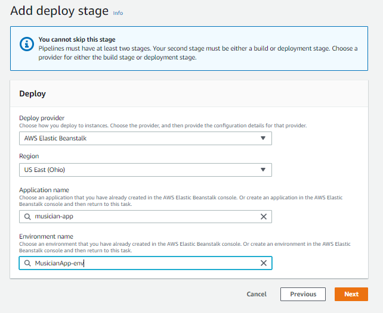

# AWS CodePipeline & Elastic Beanstalk Demo

# Introduction & Goals
- The goal of the project was to create a CI/CD pipeline on AWS using CodePipeline and Elastic Beanstalk. Our source code is a Node.js application on this github repository. Whenever we commit changes to our application in github, it will trigger our AWS Code Pipeline instance to start the deployment process. CodePipeline will deploy our application to our target webserver, which is setup in Elastic Beanstalk. 

# Application
- Our application is a Node.js application that provides read, write, and delete functionality for musicians.
- I have the app running on my localhost port 3001. The goal is to deploy this app to an EC2 webserver through Beanstalk.

# Elastic Beanstalk
- Description of service: Deploys resources to AWS EC2 instances
- The first step is to create an Elastic Beanstalk Node.js environment. This uses EC2 and S3 behind the scenes.

# CodePipeline
- Description of service: Automates continuous delivery pipelines for fast and reliable updates
- CodePipeline will be used to connect our github repo to our pipeline, and then deploy any new commits to Beanstalk.

- The first deployment failed. I made a change in 'package.json' to one line, and then I committed the file. Once this was committed, the CodePipline service automatically redeployed my environment, proving that the process works as intended.

# Results
- CodePipeline and Beanstalk creates an easy process for a CI/CD application. Beanstalk automatically creates an EC2 instance and S3 bucket behind the scenes. See the images below. The connection to the github repo automates the updates of changes in the scripts within a couple of minutes of the lastest commit.

